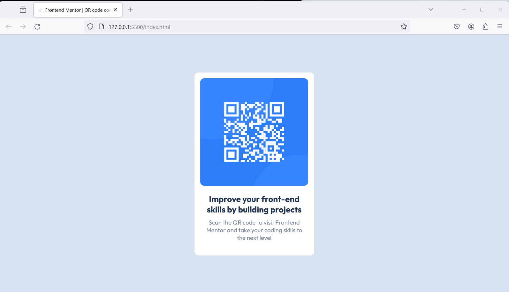

# Frontend Mentor - QR code component solution

This is a solution to the [QR code component challenge on Frontend Mentor](https://www.frontendmentor.io/challenges/qr-code-component-iux_sIO_H). Frontend Mentor challenges help you improve your coding skills by building realistic projects. 

## Table of contents

- [Frontend Mentor - QR code component solution](#frontend-mentor---qr-code-component-solution)
  - [Table of contents](#table-of-contents)
  - [Overview](#overview)
    - [Screenshot](#screenshot)
    - [Links](#links)
  - [My process](#my-process)
    - [Built with](#built-with)
    - [What I learned](#what-i-learned)
    - [Continued development](#continued-development)
  - [Author](#author)

**Note: Delete this note and update the table of contents based on what sections you keep.**

## Overview

### Screenshot




### Links

- Solution URL: [Add solution URL here](https://your-solution-url.com)
- Live Site URL: [Add live site URL here](https://your-live-site-url.com)

## My process

### Built with

- Semantic HTML5 markup
- CSS custom properties
- Flexbox


### What I learned

I learned the importance of positioning while maintaining the flow of the page. I also learned how even the slightest font size change or margin, can greatly affect the entire layout of the page if you're not careful.


```css
.heading {
    color: hsl(218, 44%, 22%);
    text-align: center;
    font-size: 21px;
    font-weight: 700;
    margin: 5px 25px;

}
```


### Continued development

I would like to increase my understanding of flexbox and grid so I can use each of them comfortably in the right scenario. Positioning is another concept I would like to continue to develop so I'm able to map exactly what I have in my head onto my page.


## Author

- Frontend Mentor - [@yourusername](https://www.frontendmentor.io/profile/dweemon)


